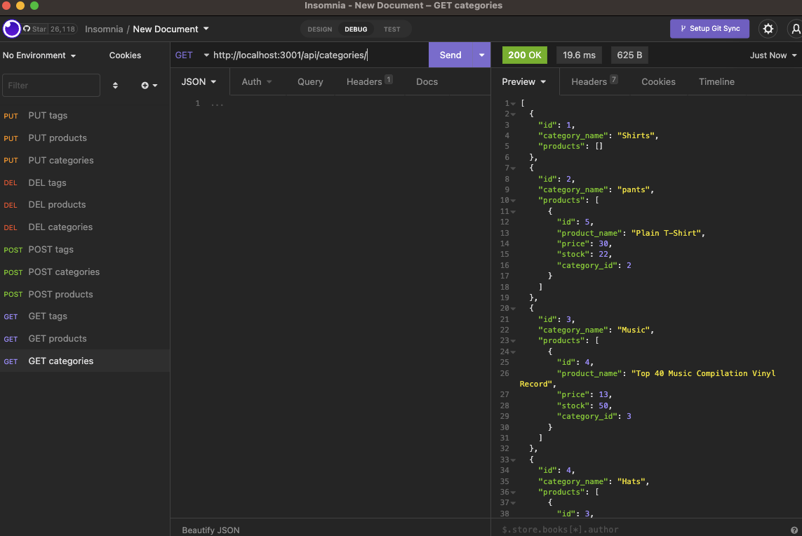

# E-commerce Back End Starter Code

## Description

The goal for this app was to develop a back-end using ORM for an e-commerce company.
A Express.js API was configured using Sequelize to interact with a MySQL database.

## Visuals:

## Video Link:

https://drive.google.com/file/d/1Jco3ki1FZ7JfayzVDqkLfN2XZ7ELVFB0/view
